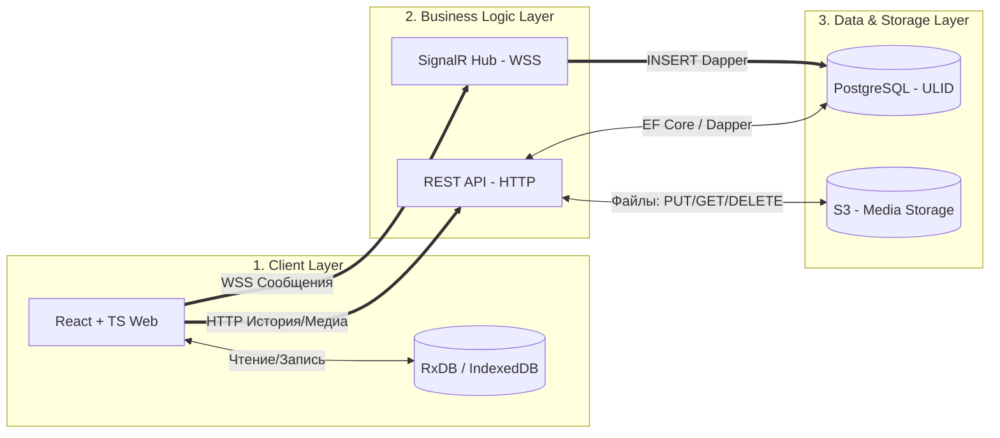

# Документация проекта «Веб-мессенджер»

## Содержание

1. [Цели и область применения](#1-цели-и-область-применения)
2. [Требования](#2-требования)
3. [Архитектура](#3-архитектура)
4. [Клиентский слой](#4-клиентский-слой)
5. [Слой маршрутизации и бизнес-логики](#5-слой-маршрутизации-и-бизнес-логики)
6. [Слой хранения данных](#6-слой-хранения-данных)
7. [Ключевые сценарии](#7-ключевые-сценарии)
8. [Безопасность и шифрование](#8-безопасность-и-шифрование)
9. [Тестирование](#9-тестирование)
10. [Структура репозитория и роли](#10-структура-репозитория-и-роли)
11. [Развёртывание](#11-развёртывание)
12. [Риски](#12-риски)
13. [Статус реализации](#13-статус-реализации)

---

## 1. Цели и область применения

**Цель:** создать веб-мессенджер для безопасного общения в реальном времени без установки отдельного приложения.

**Продукт (MVP):** веб-сервис для пользователей, которым нужна быстрая и приватная текстовая переписка.

**Входит в проект:** клиентская и серверная части, проектирование БД, регистрация и авторизация, обмен сообщениями в реальном времени, хранение истории, базовая защита данных, тестирование, развёртывание.

**Реализовано сверх базового MVP:** беседы (до 50 участников), фото и голосовые сообщения, ответы, пересылка, закреп, реакции, «прочитано», присутствие, восстановление пароля и подтверждение почты, оформление (темы, обои).

**Не входит:** звонки, видеосообщения, сквозное шифрование (E2EE), мобильные приложения.

## 2. Требования

### Функциональные

1. Регистрация пользователя
2. Авторизация и выход
3. Редактирование профиля
4. Поиск зарегистрированных пользователей
5. Создание личных диалогов
6. Отправка текстовых сообщений
7. Получение сообщений в реальном времени
8. Хранение истории переписки
9. Просмотр истории сообщений
10. Список диалогов
11. Удаление сообщения или диалога
12. Беседы, фото и голосовые сообщения
13. Ответы, пересылка, закреп, реакции
14. Восстановление пароля и подтверждение почты

### Нефункциональные

1. Корректная работа при обновлении страницы (сессия, состояние диалога, позиция в истории)
2. Безопасная передача данных (HTTPS/WSS)
3. Минимальная задержка доставки
4. Поддержка современных браузеров
5. Одновременная работа множества пользователей
6. Надёжное хранение (целостность БД)
7. Отзывчивый и адаптивный интерфейс
8. Разумное время отклика сервера
9. Конфиденциальность: доступ к диалогу только у его участников

## 3. Архитектура

Система разделена на три слоя: клиент, бизнес-логика, хранение данных.


```mermaid
flowchart LR
    subgraph L1 [1. Client Layer]
        direction TB
        React[React + TS Web]
        RxDB[(RxDB / IndexedDB)]
        React <-->|Чтение/Запись| RxDB
    end

    subgraph L3 [2. Business Logic Layer]
        direction TB
        SignalR[SignalR Hub - WSS]
        REST[REST API - HTTP]
    end

    subgraph L4 [3. Data & Storage Layer]
        direction TB
        Postgres[(PostgreSQL - ULID)]
        S3[(S3 - Media Storage)]
    end

    React ==>|WSS Сообщения| SignalR
    React ==>|HTTP История/Медиа| REST

    SignalR ==>|INSERT Dapper| Postgres
    REST <-->|EF Core / Dapper| Postgres
    REST <-->|Файлы: PUT/GET/DELETE| S3
```

**WSS** — WebSocket Secure (WebSocket поверх TLS).

### Принятые архитектурные решения

| Решение | Обоснование |
|---------|-------------|
| Offline-First (RxDB) | Мгновенный отклик интерфейса, работа при нестабильной сети |
| ULID вместо UUID/serial | Сортируемые по времени ключи — вставка в конец индекса, меньше фрагментации |
| EF Core + Dapper (CQRS-подход) | EF — для редких операций, Dapper — для высокочастотной вставки сообщений |
| Файлы через API, а не напрямую в S3 | Сервер проверяет и перекодирует картинки (WebP, без метаданных), проверяет формат голосовых и права доступа; бакет остаётся закрытым |

## 4. Клиентский слой

**Стек:** React, TypeScript, RxDB (IndexedDB).

- **Optimistic UI.** При отправке сообщение сразу записывается в локальную БД и отображается. Подтверждение от сервера обновляет его статус.
- **Реальное время.** Постоянное WSS-соединение с SignalR Hub.
- **Синхронизация после офлайна.** Клиент делает HTTP-запрос дельты, передавая `LastSyncULID` — ULID последнего известного сообщения. Сервер возвращает всё более новое.
- **Медиа.** Фото и голосовые уходят в REST API (multipart), сервер сохраняет их в S3. Файлы приватны: клиент берёт их через `fetch` с токеном, кэширует в Cache Storage и показывает blob-ссылкой.
- **Сохранение состояния** при обновлении страницы: токен сессии, открытый диалог и позиция прокрутки.

## 5. Слой маршрутизации и бизнес-логики

**Стек:** C# .NET 10, SignalR, REST API.

### Общие правила API

- Все эндпоинты, кроме `register` и `login`, требуют заголовок `Authorization: Bearer <accessToken>`.
- Идентификаторы (`id`, `userId`, `dialogId`) — ULID, строка из 26 символов. Порядок сортировки ULID совпадает с хронологическим.
- Ошибки возвращаются в формате `application/problem+json` (RFC 7807): `400` — невалидные данные, `401` — нет или неверный токен, `404` — не найдено или нет доступа, `409` — конфликт, `429` — превышен лимит запросов.
- Для чужих диалогов возвращается `404`, а не `403`, чтобы не раскрывать их существование.
- Логин и email хранятся в нижнем регистре.

### REST API

| Метод | Путь | Назначение | Ответ |
|-------|------|------------|-------|
| POST | `/api/auth/register` | Регистрация | `200` `{accessToken, expiresAt, user}`; `409` если логин или email занят |
| POST | `/api/auth/login` | Вход по логину или email | `200` `{accessToken, expiresAt, user}`; `401` при неверных данных |
| POST | `/api/auth/refresh` | Новый access-токен по httpOnly-cookie (ротация refresh-токена) | `200` `{accessToken, expiresAt, user}`; `401` |
| POST | `/api/auth/logout` | Выход: отзыв refresh-токена, очистка cookie | `204` |
| POST | `/api/auth/password` | Смена пароля `{currentPassword, newPassword}`; остальные сессии отзываются | `204`; `400` неверный текущий |
| GET | `/api/users/me` | Свой профиль | `200` `profile` |
| PUT | `/api/users/me` | Изменить `displayName`, `avatarUrl` (публичный https), `bio` (до 300; `null` — не менять, `""` — очистить) | `200` `profile` |
| GET | `/api/users/{id}` | Профиль человека; онлайн/«был(а) в сети» — только для собеседников | `200` `profile`; `404` |
| GET | `/api/users/search?q=&scope=` | **Поиск людей** по словам в логине и имени (любой порядок, `@` игнорируется); `scope=all\|contacts` | `200` `user[]` |
| GET | `/api/users?query=` | Список «Люди»: без `query` — все по алфавиту, с `query` — поиск как выше; `limit`, `offset` | `200` `user[]` |
| GET | `/api/messages/search?q=` | **Поиск сообщений** по словам (все должны встретиться), `dialogId`, `before`, `limit` | `200` `message[]` |
| PUT | `/api/messages/{id}` | Изменить текст своего сообщения | `200` `message` |
| GET | `/api/dialogs/{id}/pins` | Закреплённые сообщения | `200` `message[]` |
| PUT/DELETE | `/api/dialogs/{id}/pins/{messageId}` | Закрепить / открепить (до 10 на диалог) | `204`; `409` лимит |
| POST | `/api/dialogs/{id}/forward` | Переслать до 50 сообщений `{toDialogId, messageIds, clientBatchId}` в другой свой диалог | `200` `message[]` |
| GET | `/api/dialogs` | Список диалогов с собеседником и последним сообщением | `200` `dialog[]` |
| POST | `/api/dialogs` | Создать диалог `{userId}`; если уже есть — вернуть существующий | `201` новый, `200` существующий |
| DELETE | `/api/dialogs/{id}` | Удалить диалог целиком (у обоих участников) | `204` |
| GET | `/api/dialogs/{id}/messages` | История и дельта (параметры ниже) | `200` `message[]` по возрастанию ULID |
| DELETE | `/api/messages/{id}?scope=all\|me` | Удалить у обоих (мягкое удаление, снимает закреп) или скрыть только у себя | `204`; `404` |
| POST | `/api/auth/forgot-password`, `/reset-password`, `/confirm-email`, `/resend-confirmation` | Восстановление пароля и подтверждение почты | `204` |
| GET/PUT | `/api/users/me/appearance` | Оформление (JSON до 4 КБ) | `200` / `204` |
| POST/DELETE | `/api/users/me/avatar` | Загрузить (multipart `file`, до 5 МБ) / удалить аватар | `200` `profile` |
| GET/POST/DELETE | `/api/users/me/wallpapers[/{id}]` | Обои пользователя (до 12) | `200` / `201` / `204` |
| GET | `/api/files/avatars/{userId}/{name}`, `/api/files/group-avatars/{dialogId}/{name}` | Публичная отдача аватарок | `image/webp` |
| POST | `/api/dialogs/group` | Создать беседу `{title, memberIds}` | `201` `dialog` |
| PUT | `/api/dialogs/{id}` | Переименовать беседу (владелец) | `204` |
| GET/POST | `/api/dialogs/{id}/members` | Участники / добавить `{userIds}` (всего до 50) | `200` |
| DELETE | `/api/dialogs/{id}/members/{userId}` | `me` — выйти; чужой — исключить (владелец) | `204` |
| POST/DELETE | `/api/dialogs/{id}/avatar` | Аватар беседы | `204` |
| GET/PUT/DELETE | `/api/dialogs/{id}/reactions[/{messageId}]` | Реакции (6 эмодзи, одна на пользователя) | `200` / `204` |
| POST | `/api/dialogs/{id}/messages/media` | Фото или голосовое (multipart) | `200` `message` |
| GET | `/api/dialogs/{id}/media/{name}` | Файл вложения (только участникам, по токену) | файл |

Параметры истории сообщений:

| Параметр | Назначение |
|----------|------------|
| `after={ULID}` | Только более новые сообщения — дельта-синхронизация (`LastSyncULID`) |
| `before={ULID}` | Только более старые сообщения — подгрузка истории вверх |
| `limit` | Размер страницы, 1–100, по умолчанию 50 |

`after` и `before` нельзя указывать одновременно. Без них возвращаются последние `limit` сообщений. Удалённые сообщения в выдачу не попадают.

Формат объектов:

```
user    { id, login, displayName, avatarUrl }
profile { id, login, displayName, avatarUrl, bio, createdAt, isOnline?, lastSeenAt? }
message { id, clientMessageId, dialogId, senderId, text, mediaUrl, createdAt, editedAt,
          replyToId, forwardedFromId, forwardedFromName,
          kind (text | image | voice | system), mediaWidth, mediaHeight, mediaDurationMs }
dialog  { id, createdAt, peer: user, lastMessage: message | null, unreadCount, peerLastReadId,
          kind (direct | group), title, memberCount, myRole (owner | member) }
```

### SignalR Hub

Адрес: `/hubs/chat`. Токен передаётся в query-параметре `access_token` (для WebSocket) или в заголовке `Authorization`.

| Направление | Событие | Описание |
|-------------|---------|----------|
| клиент → сервер | `SendMessage(clientMessageId, dialogId, text)` | Отправка сообщения. Возвращает серверный ULID. Лимиты: `clientMessageId` до 64 символов, `text` 1–4000 символов |
| сервер → клиент | `MessageReceived(message)` | Новое сообщение. Приходит всем участникам диалога, включая другие устройства отправителя |
| сервер → клиент | `MessageAcked(clientMessageId, serverUlid)` | Подтверждение сохранения, только отправившему соединению |
| сервер → клиент | `MessageDeleted(dialogId, messageId)` | Сообщение удалено |
| клиент → сервер | `SendReply(clientMessageId, dialogId, text, replyToId)` | Ответ на сообщение того же диалога; ошибка `invalid_reply_to`, если цель чужая или удалена |
| сервер → клиент | `MessageEdited(message)` | Текст изменён |
| сервер → клиент | `MessagePinned(dialogId, message, pinnedById)` / `MessageUnpinned(dialogId, messageId)` | Закреп изменился |
| клиент → сервер | `Typing(dialogId)` | Статус «печатает» |
| сервер → клиент | `UserTyping(dialogId, userId)` | Собеседник печатает |
| сервер → клиент | `PresenceChanged(userId, status, lastSeen)` | `online` / `offline` для тех, с кем есть диалоги; `lastSeen` — время ухода (UTC) |
| клиент → сервер | `MarkRead(dialogId, upToId)` | Отметить диалог прочитанным до сообщения |
| сервер → клиент | `MessagesRead(dialogId, readerId, upToId)` | Участникам: сообщения прочитаны |
| клиент → сервер | `GetOnlineContacts()` / `GetLastSeen()` | Кто из собеседников онлайн / когда были в сети |
| сервер → клиент | `ReactionChanged(dialogId, messageId, userId, emoji \| null)` | Реакция поставлена, заменена или снята |
| сервер → клиент | `DialogsChanged` | Беседу создали, изменили или удалили: перезагрузить список диалогов |

Ошибки хаба приходят клиенту как `HubException` с кодом в сообщении: `forbidden` (не участник диалога), `invalid_text`, `invalid_client_message_id`, `invalid_reply_to`, `invalid_message_id`, `rate_limited`, `unauthorized`.

Соединение закрывается сервером, когда истекает access-токен, с которым оно открыто; клиент переподключается со свежим токеном.

Клиент должен отсеивать собственные сообщения в `MessageReceived` по `clientMessageId`, поскольку событие приходит и отправителю.

### Идемпотентность

Каждое сообщение несёт уникальный клиентский ключ (`clientMessageId`). Если соединение моргнуло и клиент повторил отправку, сервер находит уже сохранённое сообщение с этим ключом и не создаёт дубликат. При повторе клиент получает тот же `serverUlid` и `MessageAcked`, но `MessageReceived` участникам повторно не рассылается.

### Доступ к данным (CQRS-подход)

- **EF Core** — редкие операции (профиль, смена имени, диалоги).
- **Dapper** — сверхчастая вставка сообщений и чтение истории, прямые SQL без лишних аллокаций.

## 6. Слой хранения данных

### PostgreSQL

Основное хранилище. В качестве ключа используется **ULID**.

Модель данных:

```
users        (id ULID PK, login, email, email_confirmed_at, password_hash, display_name, avatar_url, bio,
              appearance jsonb, created_at, last_seen_at)
dialogs      (id ULID PK, created_at, pair_key UNIQUE, kind, title, avatar_url, created_by_id)
dialog_members (dialog_id FK, user_id FK, joined_at, role, last_read_id, PRIMARY KEY (dialog_id, user_id))
messages     (id ULID PK, client_message_id, dialog_id FK, sender_id FK,
              text, media_url NULL, created_at, edited_at NULL, deleted_at NULL,
              reply_to_id NULL FK→messages (ON DELETE SET NULL),
              forwarded_from_id NULL, forwarded_from_name NULL,
              kind, media_width, media_height, media_duration_ms,
              UNIQUE (sender_id, client_message_id))
pinned_messages (dialog_id FK, message_id FK, pinned_by_id, pinned_at, PRIMARY KEY (dialog_id, message_id))
message_hides   (message_id FK, user_id FK, created_at)   -- «удалить у меня»
message_reactions (message_id, user_id, dialog_id, emoji, created_at, PRIMARY KEY (message_id, user_id))
refresh_tokens  (id, user_id, token_hash, created_at, expires_at, revoked_at, replaced_by_id)
email_tokens    (id, user_id, purpose confirm|reset, token_hash, created_at, expires_at, used_at)
```

Схема ведётся миграциями EF Core (`Data/Migrations`).

Особенности реализации:

- ULID хранится в колонке `varchar(26)` с коллацией `"C"`. Без побайтового сравнения порядок сортировки не совпадёт с хронологическим.
- `created_at` сообщения проставляет БД (`now()`), чтобы часы были единые для всех инстансов бэкенда.
- Уникальный индекс `(sender_id, client_message_id)` обеспечивает идемпотентность на уровне БД.
- Индекс `(dialog_id, id)` обслуживает историю и дельта-синхронизацию.
- Поиск по частям (`ILIKE '%слово%'`) ускоряют триграммные GIN-индексы (расширение `pg_trgm`) на `messages.text`, `users.login`, `users.display_name`.
- Удаление диалога каскадно удаляет участников и сообщения; удаление сообщения — мягкое (`deleted_at`).

### Presence

Эфемерные статусы «онлайн» и «печатает» хранятся в памяти процесса. Сервер рассчитан на один инстанс; для горизонтального масштабирования понадобится общий backplane для SignalR и общее хранилище статусов. Время «был(а) в сети» (`users.last_seen_at`) хранится в БД.

### S3

Хранилище аватарок, обоев, фото и голосовых сообщений (S3-совместимое; на проде — Yandex Object Storage). Бэкенд сам читает и пишет объекты; бакет закрытый. Подробности — в разделе «Файловое хранилище (S3)».

## 7. Ключевые сценарии

### Отправка сообщения

1. Пользователь нажимает «Отправить».
2. Клиент записывает сообщение в RxDB со статусом `pending` — UI обновляется сразу.
3. Клиент отправляет `SendMessage` по WSS.
4. Hub проверяет, что пользователь состоит в диалоге, и проверяет идемпотентность.
5. Сообщение вставляется в PostgreSQL (Dapper).
6. Событие рассылается через SignalR всем участникам диалога.
7. Отправитель получает `MessageAcked`, статус меняется на `sent`.

### Возвращение из офлайна

1. Клиент восстанавливает WSS-соединение.
2. Запрашивает `GET /api/dialogs/{id}/messages?after={LastSyncULID}`.
3. Объединяет полученные сообщения с локальной БД.
4. Отправляет повторно все сообщения со статусом `pending` (идемпотентность защищает от дублей).

Ограничение: удаления старых сообщений в дельту не попадают, поскольку выдача идёт по ULID. Клиент получает их через событие `MessageDeleted` или при полной перезагрузке истории.

### Отправка фото и голосовых

1. Клиент пишет сообщение в RxDB со статусом `pending` (вложение ждёт в памяти вкладки).
2. Клиент отправляет `POST /api/dialogs/{id}/messages/media` (multipart: файл, `clientMessageId`, `kind`).
3. Сервер проверяет членство в диалоге, перекодирует фото в WebP (или проверяет формат голосового по первым байтам) и кладёт файл в S3 по ключу `media/{dialogId}/{ulid}.{ext}`.
4. Сообщение сохраняется со ссылкой `/api/dialogs/{id}/media/{name}` и рассылается участникам событием `MessageReceived`. Повтор с тем же `clientMessageId` дубликата не создаёт.

## 8. Безопасность и шифрование

### Что реализуется в MVP

| Мера | Описание |
|------|----------|
| TLS (HTTPS/WSS) | Шифрование трафика; на хостинге (Render) TLS терминируется платформой |
| Хеширование паролей | bcrypt (work factor 11); пароли в открытом виде не хранятся и не логируются. Пароль до 72 символов |
| Аутентификация | JWT access-токен (15 минут) + refresh-токен в httpOnly-cookie с ротацией и обнаружением повторного предъявления; смена пароля отзывает остальные сессии. SignalR-соединение закрывается по истечении токена |
| Авторизация | Проверка членства в диалоге при каждом чтении/записи сообщений |
| Валидация ввода | На сервере; экранирование вывода на клиенте (защита от XSS) |
| Защита от SQL-инъекций | Параметризованные запросы (EF Core, Dapper) |
| Ограничение частоты | Авторизация — 10 запросов в минуту с IP; остальной REST — 300 в минуту на пользователя (`RateLimiting:UsersPerMinute`); хаб — по методам. Перебор пароля: 10 неудач на пару «IP + логин» и 50 на аккаунт за 15 минут |
| CORS и заголовки | Строгая политика CORS (список origin в конфигурации); CSP и HSTS — заголовки ответа |
| Шифрование хранилищ | Шифрование дисков и объектов на стороне провайдера (Neon, Yandex Object Storage) |
| Секреты | Только через переменные окружения / секретницу, не в репозитории |
| Логи | Тексты сообщений и токены в логи не пишутся |

### Сквозное шифрование (E2EE)

В MVP **не реализуется.** Причины: усложняет серверный поиск и синхронизацию дельты, требует управления ключами и поддержки нескольких устройств (протокол уровня Signal), а срок проекта и размер команды ограничены. Сервер может читать содержимое сообщений, поэтому защита строится на разграничении доступа и защите инфраструктуры.

Допустимый компромисс — шифрование текста сообщения в БД на уровне приложения (AES-GCM, ключ вне БД). Решение принимается командой отдельно.

## 9. Тестирование

Тесты пишутся для обеих частей проекта; ответственный за организацию — тестировщик, но тесты к своему коду пишет каждый разработчик.

### Backend (`backend/`, `dotnet test`)

| Уровень | Что проверяем | Инструменты |
|---------|---------------|-------------|
| Unit | Бизнес-логика, валидация, выдача токена | xUnit |
| Интеграционные | REST-эндпоинты, работа с PostgreSQL, идемпотентность | WebApplicationFactory, Testcontainers (нужен Docker) |
| SignalR | Отправка/получение событий, права доступа | Microsoft.AspNetCore.SignalR.Client |

Для API-тестов файловое хранилище подменяется `InMemoryFileStorage`, настоящий S3 не нужен. Живой тест против реального бакета запускается только при заданных `STORAGE_TEST_*` (см. «Файловое хранилище»).

### Frontend (`Frontend/`)

| Уровень | Что проверяем | Инструменты |
|---------|---------------|-------------|
| Unit | Утилиты, `api.ts` (запросы, ошибки, обновление токена), `theme.ts`, `persist.ts`, `notify.ts`, `Avatar` | Vitest (`npm test`) |
| Интеграционные | `ChatProvider` целиком (синхронизация, входящие, отправка Offline-First, правка, удаление, реакции, присутствие), `AuthProvider`, локальная база | Vitest + jsdom + React Testing Library; RxDB на IndexedDB в памяти (`fake-indexeddb`); SignalR подменён, REST — через подмену `fetch` |
| E2E | Регистрация, вход и выход, поиск человека, переписка двух пользователей, непрочитанные, реакция, перезагрузка, Offline-First | Playwright (`npm run test:e2e`): настоящий браузер, бэкенд и PostgreSQL |

### Ключевые тест-кейсы

- Регистрация и вход, невалидные данные
- Недоступность чужого диалога (проверка авторизации)
- Доставка сообщения между двумя пользователями в реальном времени
- Повторная отправка не создаёт дубликат
- Синхронизация после офлайна по `LastSyncULID`
- Сохранение сессии и позиции истории после обновления страницы
- Нагрузочный тест: множество одновременных соединений

## 10. Структура репозитория и роли

```
Messenger1/
├── backend/
│   ├── Messenger.sln
│   ├── src/Messenger.Api/     # REST API + SignalR Hub
│   └── tests/Messenger.Tests/ # unit и интеграционные тесты
├── Frontend/        # React + TS + RxDB, тесты Vitest
├── Infrastructure/  # docker-compose.yml (PostgreSQL для разработки)
├── Dockerfile       # сборка фронтенда и бэкенда в один образ
├── .github/workflows/ci.yml
├── API.md
├── README.md
└── DOCUMENTATION.md
```


DevOps-задачи (CI/CD, развёртывание) распределяются между участниками.

## 11. Развёртывание

- Сервер или облачный сервер с Docker
- Контейнер backend (вместе с собранным фронтендом); PostgreSQL (Neon) и S3-совместимое хранилище (Yandex Object Storage) — внешние сервисы
- CI/CD: сборка и прогон тестов на каждый Pull Request, автоматический деплой из `main`

Для локальной разработки `docker compose -f Infrastructure/docker-compose.yml up -d` поднимает только PostgreSQL; файловое хранилище локально не поднимается (файловые функции отвечают 503). Конфигурация бэкенда задаётся переменными окружения (см. `.env.example`).

### Письма в продакшене

Прод: `https://messenger1-g19r.onrender.com`. Письма (сброс пароля, подтверждение почты) отправляются через [Resend](https://resend.com) по HTTPS API (`Email/EmailSender.cs`, `ResendEmailSender`). Встроенного почтового сервера нет. SMTP-порты (25, 465, 587) на бесплатных сервисах Render закрыты, поэтому отправка идёт по HTTPS (порт 443).

Отправитель — адрес на домене `fozu-dev.site`. Порядок настройки:

1. В Resend: Domains → Add Domain → `fozu-dev.site`. Resend покажет DNS-записи (SPF, DKIM и др.).
2. Добавить эти записи в DNS домена (там, где он управляется: регистратор, Cloudflare и т.п.), нажать Verify. Если у домена уже есть DMARC- или SPF-запись, существующие записи не перезаписывать, а дополнять по инструкции сервиса.
3. В Resend: API Keys → создать ключ с правом отправки.
4. В Environment на Render задать переменные из таблицы и перезапустить сервис.

| Переменная | Значение |
|---|---|
| `Resend__ApiKey` | API-ключ Resend |
| `Resend__From` | `no-reply@fozu-dev.site` (адрес на подтверждённом домене) |
| `Resend__FromName` | имя отправителя, по умолчанию `Messenger` |
| `App__PublicBaseUrl` | `https://messenger1-g19r.onrender.com`: из него строятся ссылки `/reset#token=…` и `/confirm#token=…` |
| `Cors__Origins__0` | `https://messenger1-g19r.onrender.com` |

- Приоритет отправителя: Resend, если задан `Resend__ApiKey`; иначе SMTP (`Smtp__*`, нужен платный инстанс Render или локальный запуск); иначе заглушка. Заглушка в Development пишет письмо в лог, в Production только предупреждение без тела письма (в нём токен).
- Ошибки отправки (например, неподтверждённый домен) пишутся в лог бэкенда и не ломают запрос.
- Лимиты бесплатного тарифа Resend ограничены (на момент написания — порядка 100 писем в день); актуальные условия — на сайте сервиса.
- `Auth__RequireConfirmedEmail` включается только после проверки, что письма доходят.

## 12. Риски

| Риск | Меры |
|------|------|
| Нехватка времени | Строгий приоритет функций MVP, отказ от второстепенного |
| Уязвимости из-за ошибок архитектуры | Анализ рисков и безопасности до разработки, ревью кода |
| Уязвимости сторонних библиотек | Обновление зависимостей, аудит (`npm audit`, `dotnet list package --vulnerable`) |
| Недоступность сервисов для деплоя | Запасной вариант хостинга, возможность локального запуска через Docker |
| Сложность Offline-First синхронизации | Раннее прототипирование, интеграционные тесты |

## 13. Статус реализации

Отражает состояние бэкенда; обновлять при изменениях.

| Область | Статус |
|---------|--------|
| Модели и схема БД (EF Core), миграции | Реализовано; 10 миграций: от `InitialCreate` до `AddEmailTokens` (профиль, ответы, пересылка, закреп, триграммные индексы, оформление, беседы и вложения, реакции, токены из писем) |
| Сохранение сообщений через Dapper, идемпотентность | Реализовано |
| SignalR Hub (отправка, ответы, подтверждение, печатает, прочитано, присутствие) | Реализовано |
| REST: аутентификация, профиль, раздельный поиск людей и сообщений, диалоги, история, правка, удаление, закреп, пересылка | Реализовано |
| Presence | В памяти процесса (один инстанс) |
| Refresh-токены, отзыв при выходе и смене пароля | Реализовано; очистка просроченных — фоновая задача раз в час |
| Медиа: фото, голосовые, аватарки с кадрированием, обои (S3) | Реализовано; видео не поддерживается |
| Реакции на сообщения (6 эмодзи, одна на пользователя) | Реализовано: `GET/PUT/DELETE /api/dialogs/{id}/reactions`, событие `ReactionChanged` |
| Rate limiting | `users` — REST по пользователю, скользящее окно (300/мин); `auth` — вход, регистрация, сброс, по IP (10/мин); `mail` — отправка писем, по IP (5 за 15 мин); методы хаба. `429` содержит `Retry-After`. Состояние в памяти процесса |
| Восстановление пароля, подтверждение почты | Реализовано: одноразовые токены (в БД только SHA-256), письма через Resend (HTTPS) или SMTP; см. `API.md` |
| ForwardedHeaders за прокси | Реализовано (`ForwardLimit = 1`, список доверенных прокси задаётся конфигурацией) |
| Dockerfile, CI | Реализовано |
| Тесты бэкенда | Написаны; прогон на актуальной среде требует подтверждения |

## Клиент: действия с сообщениями, поиск и профиль

- **Меню сообщения** открывается правой кнопкой мыши, долгим нажатием (500 мс) или кнопкой «⋯»; управление стрелками и Esc. Пункты: «Ответить», «Копировать» (при выделении текста — «Копировать выделенное»), «Изменить» (только своё), «Закрепить/Открепить», «Переслать…», «Удалить». Ответ, закреп и пересылка доступны только для уже отправленных сообщений (у них есть серверный id).
- **Ответ** уходит методом хаба `SendReply`; если исходное сообщение к моменту отправки удалено, текст отправляется как обычное сообщение. Цитата в пузыре ведёт к оригиналу.
- **Закреп** общий для диалога: строка над перепиской, клик прокручивает к сообщению и переключает на следующее закреплённое. Список берётся с сервера (`GET /pins`) и обновляется событиями `MessagePinned`/`MessageUnpinned`.
- **Пересылка** работает только онлайн (`POST /forward`); метка «Переслано от …» показывается над текстом.
- **Разделы (боковая панель):** «Чаты», «Люди», «Настройки». На телефоне та же панель внизу; при открытом диалоге она скрыта.
- **Поиск разделён по местам:** в «Чатах» — по имени или логину собеседника (локально); в «Людях» — по всем пользователям (`/api/users/search`, по 30 за раз, «Показать ещё»); по тексту — внутри самого чата (лупа в шапке, `/api/messages/search?dialogId=`, по 30 за раз). Найденное сообщение подсвечивается; если оно старше загруженной истории, история подгружается страницами вверх. Слова ищутся в любом порядке.
- **Профиль:** клик по имени в шапке диалога или по человеку в «Людях» открывает профиль («о себе», статус, дата регистрации; в «Людях» — кнопка «Написать»).
- **Настройки сгруппированы:** Аккаунт (профиль, безопасность), Приложение (внешний вид, уведомления), Устройство (сессия и кэш). «Внешний вид»: тема авто/светлая/тёмная и акцентный цвет (хранятся в `localStorage`, `lib/theme.ts`). Вкладки «Синхронизация» нет: синхронизация автоматическая.
- **Статус «в сети»:** зелёная точка на аватаре (у тех, кто не в сети, точки нет) и зелёная подпись «в сети» в шапке диалога и профиле.
- **Порционная загрузка:** история диалога — по 50 сообщений (вверх по прокрутке), дельта-синхронизация — по 100; люди и результаты поиска — по 30; список диалогов загружается целиком.

## Файловое хранилище (S3)

Файлы (аватарки, обои, голосовые, фото) хранятся не в БД и не на диске сервера (на Render диск эфемерный), а в S3-совместимом хранилище. Код работает через интерфейс `IFileStorage` (`Storage/`): `PutAsync`, `GetAsync`, `DeleteAsync`, `CopyAsync`, `ListAsync`. Реализация `S3FileStorage` работает с любым S3-совместимым провайдером; на проде это Yandex Object Storage.

**Локально хранилище не поднимается.** MinIO убран из `docker-compose`, поэтому при локальной разработке медиа нет (тесты API используют хранилище в памяти, `InMemoryFileStorage`): без `Storage__*` приложение стартует с заглушкой `DisabledFileStorage`, а загрузка аватарок, обоев, фото и голосовых отвечает `503`. Всё остальное работает.

| Переменная | Прод (Yandex Object Storage) |
|---|---|
| `Storage__Endpoint` | `https://storage.yandexcloud.net` |
| `Storage__Region` | `ru-central1` |
| `Storage__Bucket` | имя бакета |
| `Storage__AccessKey` / `Storage__SecretKey` | статический ключ сервисного аккаунта |
| `Storage__ForcePathStyle` | `false` |
| `Storage__EnsureBucket` | `false` (бакет создаётся в консоли) |

- **При старте** (если хранилище настроено) в лог пишется «Storage is ready» либо предупреждение с причиной; ошибка хранилища не останавливает приложение.
- **Настройка Yandex Cloud:** 1) создать бакет (доступ «ограниченный»); 2) создать сервисный аккаунт с ролью `storage.editor` на каталог или бакет; 3) выпустить ему статический ключ доступа (идентификатор и секрет показываются один раз); 4) задать переменные в Environment сервиса на Render. Ключи не коммитятся. CORS бакета не нужен: браузер с хранилищем напрямую не общается.
- **Ключи объектов:** `avatars/{userId}/{ulid}.webp`, `wallpapers/{userId}/{ulid}.webp`, `group-avatars/{dialogId}/{ulid}.webp`, `media/{dialogId}/{ulid}.{webp|ogg|webm|m4a|mp3}`.
- **Проверка против настоящего бакета:** тест `Live_roundtrip_against_a_real_bucket_when_configured` выполняется, только если заданы `STORAGE_TEST_BUCKET`, `STORAGE_TEST_ACCESS_KEY`, `STORAGE_TEST_SECRET_KEY` (и при необходимости `STORAGE_TEST_ENDPOINT`, `STORAGE_TEST_REGION`); иначе пропускается.
- Если Yandex отвечает ошибкой подписи при загрузке, первым делом проверьте регион (`ru-central1`) и endpoint; контрольные суммы SDK по умолчанию отключены (`WHEN_REQUIRED`), так как не все S3-совместимые хранилища их понимают.

## Загрузка аватарок и обои

- **Обработка** (`Media/ImageProcessor.cs`, SkiaSharp): реальное декодирование, лимит 36 Мпикс (защита от «бомб»), поворот по EXIF, перекодирование в WebP — так в хранилище попадают только безопасные картинки без метаданных.
- **Ключи:** `avatars/{userId}/{ulid}.webp` (публичные, неизменяемые, кэш на год) и `wallpapers/{userId}/{ulid}.webp` (приватные, путь строится от текущего пользователя). При смене аватарки прежний файл удаляется.
- **Оформление** (`users.appearance`, jsonb): тема, акцентный цвет, обои (пресет или загруженное фото + затемнение), форма пузырей, плотность, шрифт и размер текста. Клиент держит копию в `localStorage` и синхронизирует с сервером (`lib/theme.ts`), поэтому вид одинаков на всех устройствах. Пресеты обоев — CSS без файлов.
- **Дальше по той же схеме:** фото и голосовые сообщения (`media/`) — приватные файлы с проверкой членства в диалоге.

## Беседы, фото и голосовые

- **Модель:** `dialogs.kind` (`direct`/`group`), `title`, `avatar_url`, `created_by_id`; `dialog_members.role` (`owner`/`member`); `messages.kind` (`text`/`image`/`voice`/`system`), `media_width`, `media_height`, `media_duration_ms` (миграция `AddGroupsAndMedia`). Личные диалоги по-прежнему уникальны по `pair_key`.
- **Права в беседе:** создатель (owner) переименовывает и исключает, добавлять участников и менять фото может любой участник; владелец удаляет беседу для всех, остальные выходят. Владение переходит к самому раннему участнику, если владелец вышел.
- **Реальное время:** сообщения беседы доставляются тем же `MessageReceived` всем участникам; изменения состава и названия сопровождаются служебными сообщениями и событием `DialogsChanged`.
- **Клиент:** у беседы синтетический `peer` (название и аватар беседы), поэтому список, пересылка и поиск работают без особых случаев; в беседе над входящими сообщениями показывается имя автора, под названием — число участников, при наборе текста — имя печатающего. Создание — кнопка «+» в «Чатах», управление — клик по шапке беседы.
- **Вложения:** кнопка скрепки (или вставка картинки из буфера) отправляет фото с подписью из поля ввода; микрофон записывает голосовое (до 5 минут, MediaRecorder). Вложения уходят по REST (multipart), офлайн ждут в очереди, пока открыта вкладка. Фото открывается на весь экран, голосовые воспроизводятся по одному.
- **Хранилище:** `media/{dialogId}/{ulid}.{ext}` (приватно, только участникам) и `group-avatars/{dialogId}/{ulid}.webp` (публично). Локальная БД клиента — `messenger5-…`.

## Реакции и кадрирование аватарки

- **Реакции:** в меню сообщения — строка из 6 эмодзи; под пузырём — чипы с количеством, клик ставит/снимает свою реакцию. Таблица `message_reactions` (PK `message_id, user_id`). Список реакций диалога клиент берёт с сервера при открытии диалога и держит в памяти.
- **Кадрирование:** при выборе фото для профиля или беседы открывается редактор (`AvatarCropper`): картинку двигают и масштабируют, на сервер уходит готовый квадрат 512×512.
