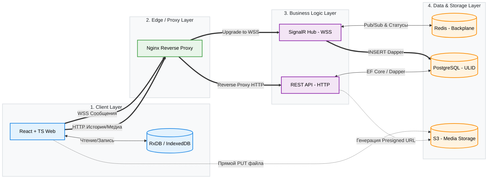

**WSS** расшифровывается как **WebSocket Secure**
Роли - бекенд, фронтенд, девопс, тестировшик

### Слой клиентского приложения (TS, React, RxDB)

Отвечает за реализацию архитектуры Offline-First и обеспечение мгновенного отклика интерфейса. Фронтенд не дожидается ответа от сервера: при отправке сообщения оно моментально записывается в локальную базу данных IndexedDB (через RxDB), и интерфейс перерисовывается (Optimistic UI). В фоновом режиме React-приложение поддерживает постоянное WSS-соединение для обмена событиями в реальном времени, а при выходе из оффлайна делает HTTP-запрос дельты сообщений, передавая серверу маркер последнего известного сообщения (`LastSyncULID`). Разработчик этого слоя также реализует логику загрузки тяжелых медиафайлов: клиент запрашивает у сервера короткоживущую ссылку (Pre-signed URL) и отправляет бинарные данные напрямую в объектное хранилище S3, полностью минуя бэкенд.

### Слой маршрутизации и бизнес-логики (Nginx, C# .NET 8)

Берет на себя распределение трафика и валидацию всех действий пользователей. Единой точкой входа выступает Nginx, который расшифровывает HTTPS-трафик и жестко разделяет его: обычные запросы проксируются на REST API, а сокеты повышаются (Upgrade) и уходят в SignalR. Внутри C#-бэкенда реализован гибридный доступ к данным (CQRS): для редких операций вроде смены имени используется Entity Framework Core, а для сверхчастой вставки тысяч сообщений в секунду — Dapper (прямые SQL-запросы без аллокаций памяти). На уровне SignalR также встроена система идемпотентности, которая проверяет уникальные ключи клиентских запросов и гарантирует, что если у пользователя моргнул интернет, сервер не создаст в базе дубликат сообщения.

### Слой хранения данных (PostgreSQL, Redis, S3)

Обеспечивает персистентность, изоляцию нагрузок и возможность горизонтального масштабирования всей системы. Ядром выступает PostgreSQL, где для таблицы сообщений применяется партиционирование и сортируемые ключи ULID — это позволяет добавлять новые данные строго в конец таблицы, избегая фатальной фрагментации дисковых индексов. Оперативный кэш Redis работает в двух направлениях: как шина сообщений (Backplane) для трансляции событий между разными физическими серверами C# и как хранилище эфемерных статусов (Presence), забирая на себя весь мусорный трафик вроде «пользователь онлайн» или «печатает», чтобы не блокировать основную СУБД. Хранилище S3 работает автономно, выступая бездонным архивом для картинок и видео, оставляя реляционную базу легковесной.

